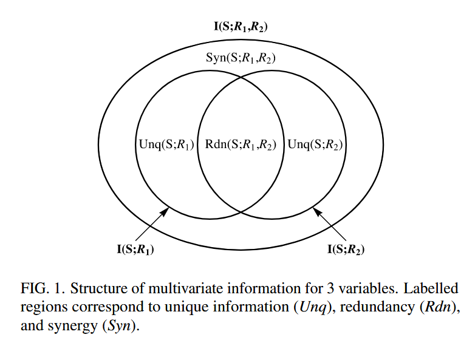

# 为什么需要使用非负分解

## 两个变量的交互信息总是非负的，但扩展到三个变量时可能出现负值

在原始的信息论中，使用$I(X_1;X_2;Y)$来表示三个变量之间的交互信息。

$$I(X_1;X_2;Y) = I(X_1;X_2) - I(X_1;X_2|Y)$$

这里的$I(X_1;X_2;Y)$描述的是，知道$Y$之后，$X_1$和$X_2$之间互信息减少了多少。

### 纯粹的冗余 - COPY Gate

- **设置**: 我们有两个完全相同的信源 $X_1$ 和 $X_2$，目标 $Y$ 也是它们的一个副本。比如，$X_1$ 和 $X_2$ 都是一个随机的0或1比特，且 $X_1 = X_2$，$Y = X_1$。
- **计算$I(X_1; X_2; Y)$**:
  1. $I(X_1; X_2)$: 因为 $X_1 = X_2$，它们完全相关，所以 $I(X_1; X_2) = H(X_1) = 1$ bit。
  2. $I(X_1; X_2 | Y)$: 因为 $Y = X_1$，所以知道了 $Y$ 就知道了 $X_1$。又因为 $X_1 = X_2$，所以知道了 $Y$ 也就知道了 $X_2$。在已知 $Y$ 的条件下，$X_1$ 和 $X_2$ 之间没有任何不确定性，它们是确定性相关的，因此 $I(X_1; X_2 | Y)$ 也等于 $H(X_1|Y) = 0$ bit 左右（严格来说是$I(X_1;X_2|Y) = H(X_1|Y) - H(X_1|X_2,Y) = 0 - 0 = 0$）。
  3. **结果**: $I(X_1; X_2; Y) = 1 - 0 = 1 > 0$。

### 纯粹的协同 - XOR Gate

- **设置**: $X_1$ 和 $X_2$ 是两个独立的随机0或1比特。$Y = X_1 \oplus X_2$。
- **计算 $I(X_1; X_2; Y)$**:
  1. $I(X_1; X_2)$: 因为 $X_1$ 和 $X_2$ 是独立生成的，它们之间没有互信息。$I(X_1; X_2) = 0$。
  2. $I(X_1; X_2 | Y)$: 现在我们知道了 $Y$ 的值。
     - 如果 $Y=0$，那么我们知道 $X_1$ 必须等于 $X_2$。
     - 如果 $Y=1$，那么我们知道 $X_1$ 必须不等于 $X_2$。
     - 在任何情况下，知道了 $Y$ 之后，$X_1$ 和 $X_2$ 变得**完全相关**了！因此，$I(X_1; X_2 | Y) = H(X_1|Y) - H(X_1|X_2,Y) = 1 - 0 = 1$ bit。
  3. **结果**: $I(X_1; X_2; Y) = 0 - 1 = -1 < 0$。

### 冗余与协同相互抵消的例子（共享位 Z + XOR）

- 设置:
  - 取独立均匀比特 Z, U1, U2。
  - 信源：X1 = (Z, U1), X2 = (Z, U2)，两者共享同一个 Z（1 bit 冗余）。
  - 目标：Y = (Z, U1 ⊕ U2)。其中 Z 提供冗余信息，U1 ⊕ U2 提供纯协同信息。

- 计算:
    1. I(X1; X2) = I((Z,U1); (Z,U2)) = H(Z) = 1 bit（来自共享位 Z）。
    2. 令 W = U1 ⊕ U2，则
         I(X1; X2 | Y) = I((Z,U1); (Z,U2) | Z, W) = I(U1; U2 | W) = 1 bit
         （给定 W，U1 与 U2 完全相关：W=0 时相等，W=1 时相反）。
    3. 结果：I(X1; X2; Y) = I(X1; X2) − I(X1; X2 | Y) = 1 − 1 = 0。

- 直观解释：
  - Z 在两个信源中同时可获，贡献 1 bit 冗余；
  - U1 ⊕ U2 仅由二者合用才能确定，贡献 1 bit 协同；
  - 二者同量异号，在交互信息中正负抵消为 0，但系统同时存在冗余与协同。

信息论中使用一个单一的数值来概括多变量之间的信息结构，正值被解释为协同，负值被解释为冗余。然而一个系统可能同时存在冗余和协同，**这两种效应相互抵消时，交互信息的值为0**，但不意味着变量之间没有交互。

## 部分信息分解认为交互信息为负是冗余与协同混淆导致的

> 注：事实上此图并不能完全理解为文式图。R1，R2的联合分布与R1，R2的关系不能如此直观的显式表示。
